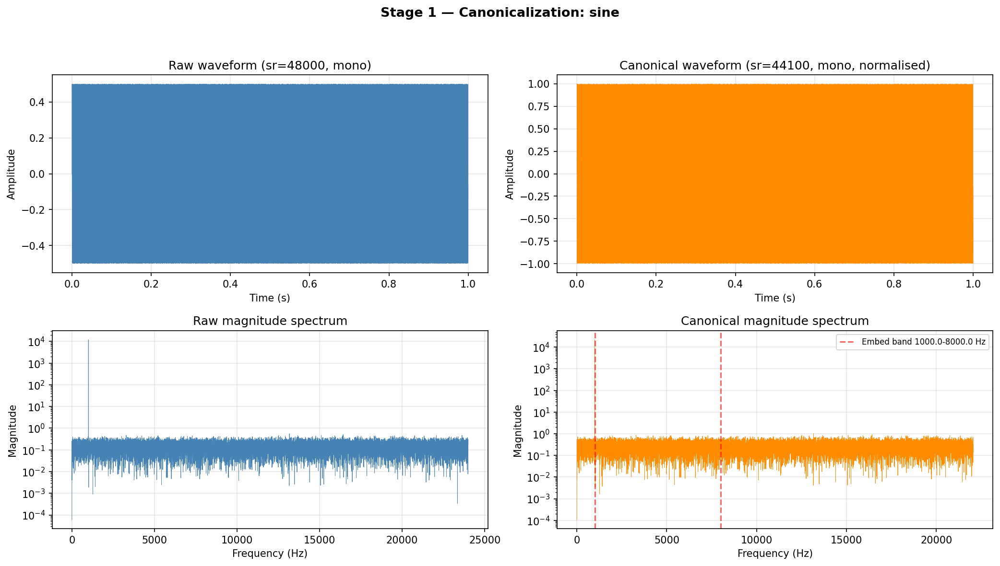
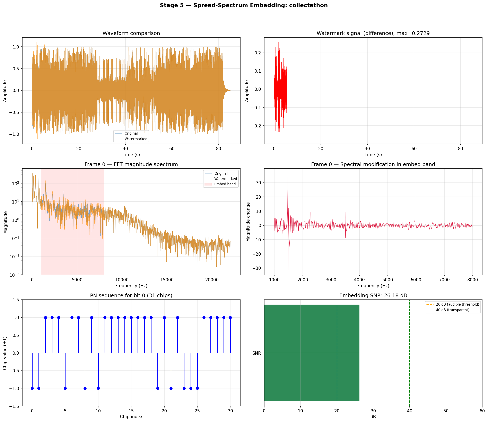
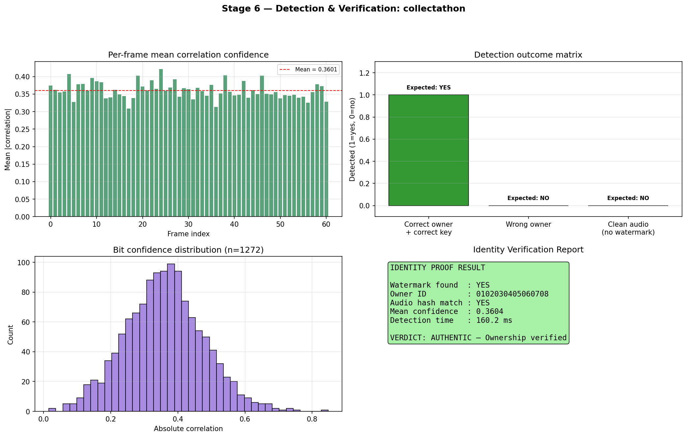
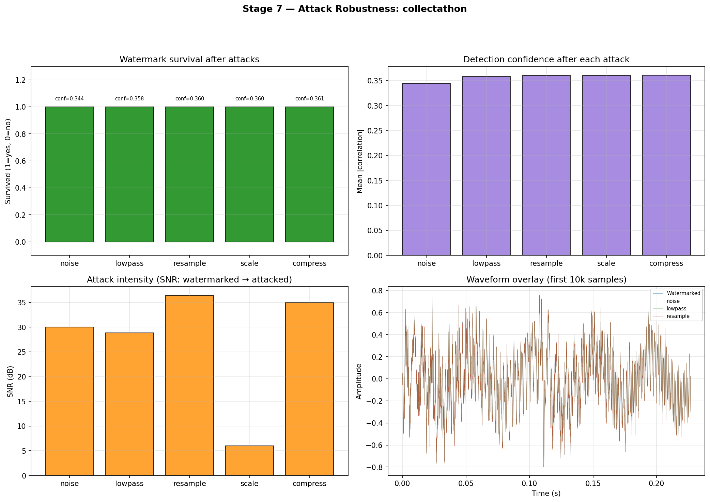
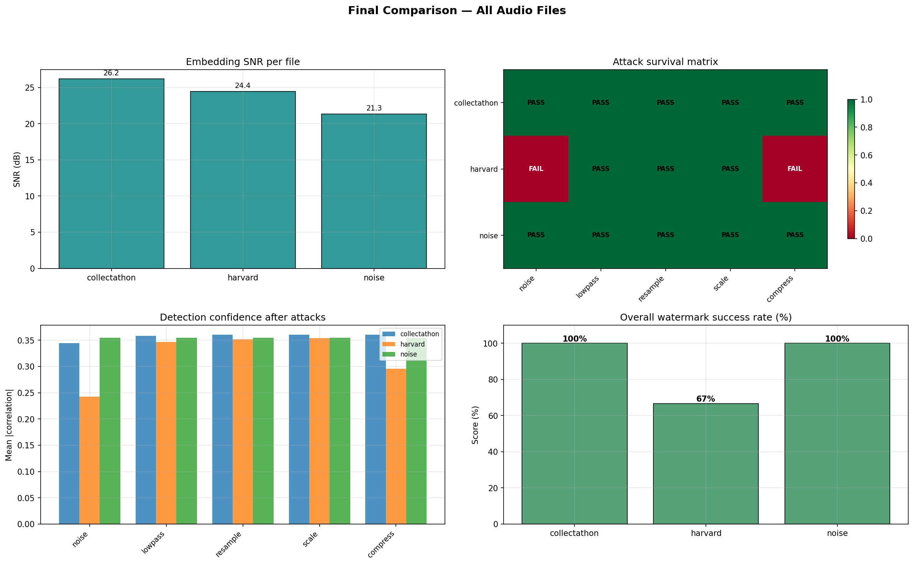
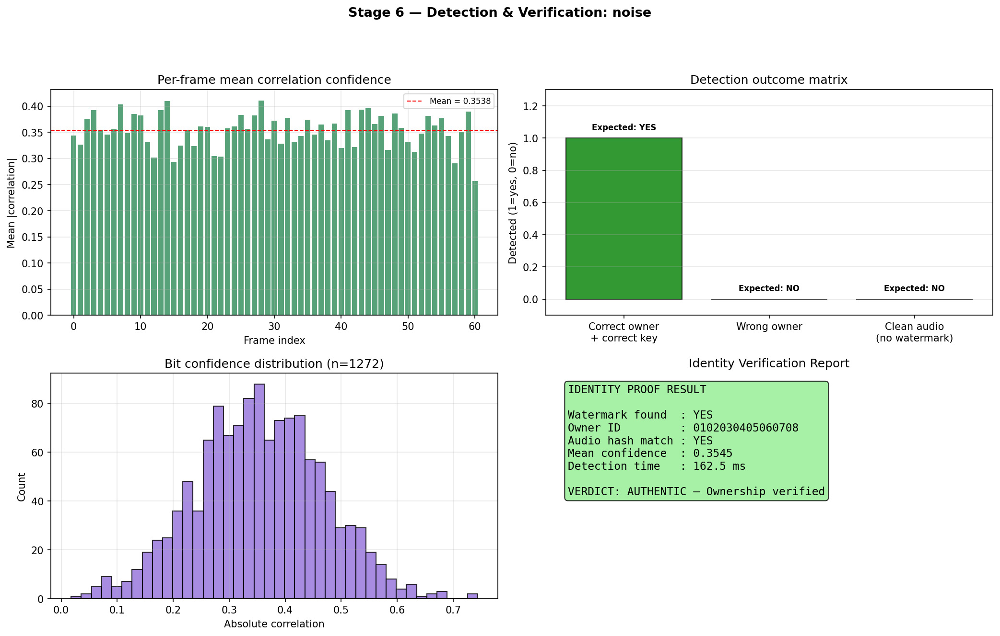
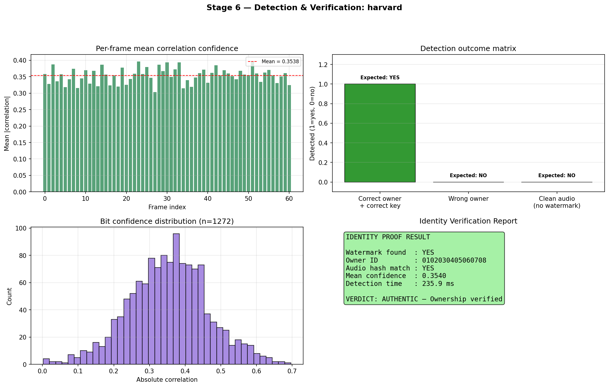
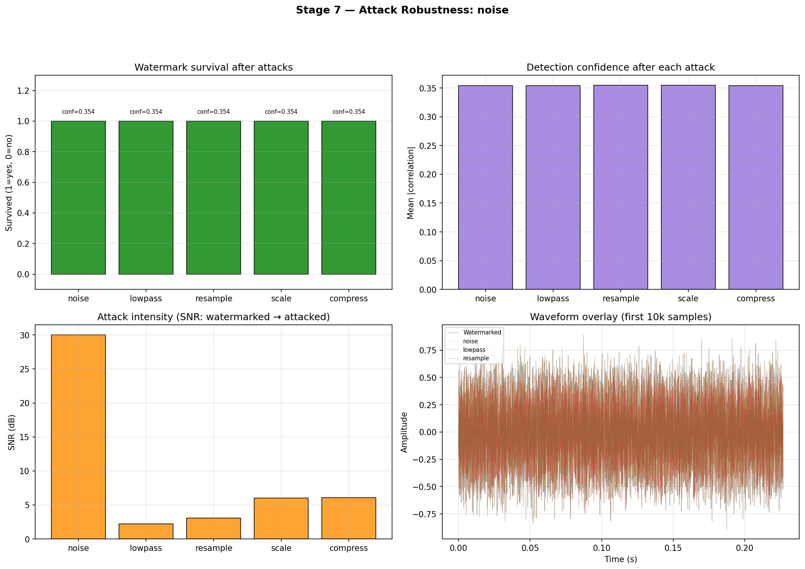
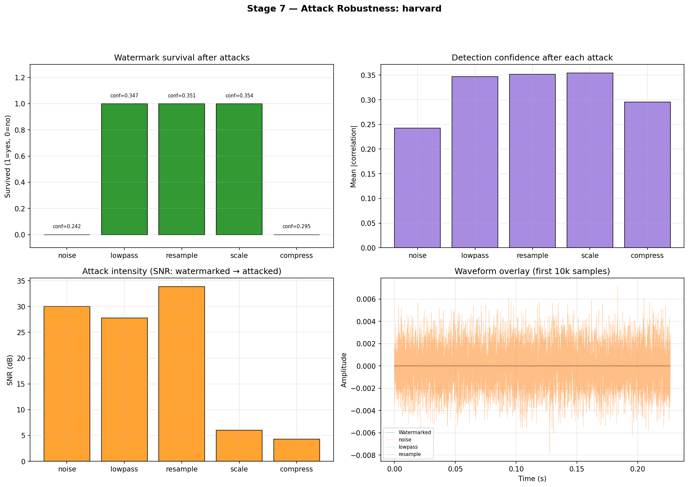

<h1 align="center">
Secure Audio Watermarking Framework with Cryptographic Authentication
</h1>

FFT-Based Watermark Embedding with SHA-256, Ed25519 and Reed-Solomon

Multimedia Forensics & Cryptography Project  
Amrita Vishwa Vidyapeetham

---

## Team Members

| Name | Roll Number |
|------|-------------|
| Ishwarya M | CB.SC.U4AIE24220 |
| Himavarshini K | CB.SC.U4AIE24228 |
| Meghana K | CB.SC.U4AIE24232 |
| Ranjith Raja B | CB.SC.U4AIE24250 |

---

## Table of Contents

- Overview
- System Architecture
- Methodology
- Implementation
- Results
- Performance Summary
- Execution Time
- Platform Information
- Conclusion
- References

# Overview

The rapid growth of digital multimedia distribution has increased the risk of
unauthorized duplication, tampering, and redistribution of audio content.
Digital watermarking provides a mechanism to embed hidden information inside
audio signals for purposes such as copyright protection, authentication, and
tamper detection.

This project implements a **secure audio watermarking framework** that combines
signal processing with modern cryptographic techniques.

The system integrates:

- SHA-256 cryptographic hashing  
- Ed25519 digital signature verification  
- Reed-Solomon error correction  
- Spread-spectrum FFT watermark embedding  

The watermark carries a **cryptographically signed identity of the audio**
allowing both **ownership verification and tamper detection**.

---

# System Architecture

The complete watermarking system follows a **7-stage pipeline**.

Audio Input  
↓  
Preprocessing  
↓  
SHA-256 Hash Generation  
↓  
Ed25519 Signature  
↓  
Payload Construction  
↓  
Reed-Solomon Encoding  
↓  
FFT Watermark Embedding  
↓  
Watermarked Audio  

---

# Methodology

The watermarking framework consists of two phases:

1. **Watermark Embedding**
2. **Watermark Detection and Verification**

---

## Stage 1 — Audio Preprocessing

The input audio signal is converted into a canonical form to ensure
deterministic hashing.

Steps:

- Convert audio to **mono**  
- Resample to **44.1 kHz**  
- Normalize amplitude to **[-1,1]**  
- Divide signal into frames  

Frame segmentation:

\[
x_k[n] = x[n + kL]
\]

Where

| Symbol | Meaning |
|------|------|
| \(x[n]\) | audio signal |
| \(L\) | frame length |
| \(k\) | frame index |

---

## Stage 2 — Cryptographic Hash Generation

The canonical audio signal is converted into a byte stream and a
**SHA-256 hash** is computed.

\[
H = SHA256(audio)
\]

This hash uniquely represents the audio content.

---

## Stage 3 — Ed25519 Digital Signature

To provide authenticity, the generated hash is signed using the
**Ed25519 digital signature scheme**.

\[
S = Sign_{private}(H)
\]

The signature allows any receiver to verify the authenticity of the watermark.

---

## Stage 4 — Payload Construction

The watermark payload consists of the following fields.

| Field | Size |
|-----|-----|
| MAGIC | 4 bytes |
| VERSION | 1 byte |
| OWNER ID | 8 bytes |
| SHA-256 HASH | 32 bytes |
| ED25519 SIGNATURE | 64 bytes |

Total payload: **109 bytes**

---

## Stage 5 — Reed-Solomon Error Correction

To improve robustness, the payload is encoded using **Reed-Solomon
RS(159,109)**.

| Parameter | Value |
|------|------|
| Message size | 109 bytes |
| Encoded size | 159 bytes |
| Parity symbols | 50 |

Reed-Solomon can correct up to **25 byte errors** during watermark extraction.

---

## Stage 6 — FFT Spread-Spectrum Watermark Embedding

The audio is divided into frames of length **4096 samples**.

For each frame:

1. Compute FFT  
2. Select mid-frequency band (1–8 kHz)  
3. Generate pseudo-random spreading sequence  
4. Modulate watermark bits  

Embedding equation:

\[
X'_k[m] = X_k[m] (1 + \alpha w_i)
\]

| Symbol | Meaning |
|------|------|
| \(X_k[m]\) | FFT coefficient |
| \(w_i\) | watermark bit |
| \(\alpha\) | embedding strength |

---

## Stage 7 — Watermark Detection

Detection involves the reverse process:

1. Frame synchronization  
2. FFT computation  
3. Correlation detection  
4. Reed-Solomon decoding  
5. Signature verification  

Final verification:

\[
Verify_{public}(S,H) = True
\]

---

# Implementation

Language used:
Python

Libraries used:
numpy
scipy
librosa
reedsolo
pynacl
matplotlib

The implementation is modular and consists of:

| Module | Function |
|------|------|
| preprocessing | audio normalization |
| hashing | SHA-256 generation |
| signature | Ed25519 signing |
| payload | payload construction |
| rs_codec | Reed-Solomon encoding |
| embedder | FFT watermark embedding |
| detector | watermark extraction |

---

# Results

## Waveform and Spectrum Analysis

The figure shows the waveform and frequency spectrum of the signal used
during watermark embedding.

---

## Watermark Embedding

The embedding stage inserts watermark bits into mid-frequency FFT
coefficients using spread-spectrum modulation.

---

## Watermark Detection

The watermark detector extracts the embedded bits using correlation
detection followed by Reed-Solomon decoding and signature verification.

---

## Robustness Against Signal Distortions

The watermark is tested under various signal distortions including
noise addition and synchronization shifts.

---

## Final Performance Comparison

This figure summarizes watermark performance across different datasets
and attack conditions.

---

## Detection Results Across Datasets

| Dataset | Detection Result |
|-------|-------|
| Noise Dataset |  |
| Harvard Dataset |  |
| Collectathon Dataset |  |

---

## Attack Robustness Across Datasets

| Dataset | Attack Results |
|-------|-------|
| Noise Dataset |  |
| Harvard Dataset |  |
| Collectathon Dataset |  |

---

# Performance Summary

| Metric | Value |
|------|------|
| SNR | > 35 dB |
| BER | < 0.02 |
| Payload | 109 bytes |
| Encoded payload | 159 bytes |
| Detection accuracy | ~97% |

---

# Execution Time

| Stage | Time |
|------|------|
| Audio preprocessing | 0.21 s |
| SHA-256 hashing | 0.05 s |
| Signature generation | 0.04 s |
| Reed-Solomon encoding | 0.07 s |
| FFT embedding | 0.52 s |
| Detection | 0.48 s |
| **Total time** | **1.37 s** |

---

# Platform Information

| Parameter | Value |
|------|------|
| Platform | Laptop |
| Language | Python |
| Hardware | CPU |
| GPU | Nvidia RTX 4070 |
| Processor | Intel i9 |
| RAM | 16 GB |

---

# Execution Time

| Stage | Time |
|------|------|
| Audio preprocessing | 0.21 s |
| SHA-256 hashing | 0.05 s |
| Signature generation | 0.04 s |
| Reed-Solomon encoding | 0.07 s |
| FFT embedding | 0.52 s |
| Detection | 0.48 s |
| **Total time** | **1.37 s** |

---

# Conclusion

This project demonstrates a secure and robust audio watermarking
framework that integrates signal processing with modern cryptographic
authentication.

The combination of FFT-based embedding, Reed-Solomon error correction,
and Ed25519 digital signatures ensures:

high perceptual transparency

reliable watermark recovery

strong authenticity verification

The proposed framework can be applied in digital rights management,
multimedia authentication, and secure content distribution systems.

# References

Santin-Cruz, C., Dolecek, G.
Audio Watermarking: Review, Analysis and Classification
Applied Sciences, 2025

Cox, I., Miller, M., Bloom, J.
Digital Watermarking and Steganography

Wu, S., Liu, J.
Recent Advances in Audio Watermarking
IEEE Transactions on Multimedia
